This document is for anyone who wants to set up their own ICON Development Network on AWS.

## Intended Audience
Someone who needs their own "ICON Development Network" for ICON SCORE or DApp.

## Purpose
Following this document step-by-step will all reader to set up their own ICON Development Network on AWS.

## Prerequisites
### Create an Amazon EC2 Key Pair
AWS uses public-key cryptography to secure the login information for your instance. A Linux instance has no password; you use a key pair to log in to your instance securely. You specify the name of the key pair when you launch your instance, then provide the private key when you log in using SSH.
If you haven't created a key pair already, you can create one using the Amazon EC2 console. Note that if you plan to launch instances in multiple regions, you'll need to create a key pair in each region.

1. Sign in to AWS
2. From the AWS dashboard, choose **EC2** to open the Amazon EC2 console.
3. From the navigation bar, select a region for the key pair. You can select any region that's available to you, regardless of your location. However, key pairs are specific to a region; for example, if you plan to launch an instance in the US East (Ohio) Region, you must create a key pair for the instance in the US East (Ohio) Region.
4. In the navigation pane, under **NETWORK & SECURITY**, choose **Key Pairs**.
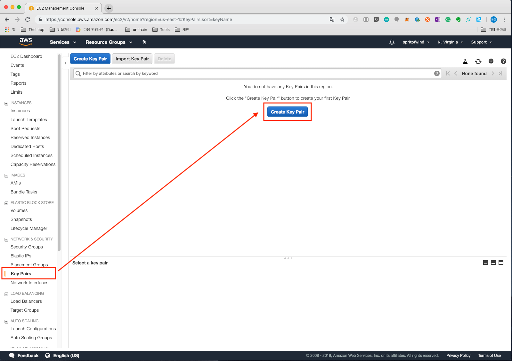
5. Choose **Create Key Pair**.
6. Enter a name for the new key pair in the **Key pair name** field of the **Create Key Pair** dialog box, and then choose **Create**. Use a name that is easy for you to remember, such as your IAM user name, followed by -key-pair, plus the region name. For example, me-key-pair-useast2.
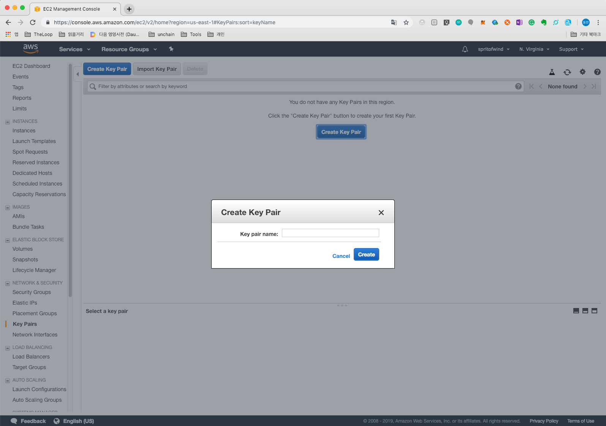
7. The private key file is automatically downloaded by your browser. The base file name is the name you specified as the name of your key pair, and the file name extension is .pem. Save the private key file in a safe place.
8. If you are using an SSH client on a Mac or Linux computer to connect to your Linux instance, use the following command to set the permissions of your private key file so that only you can read it. If you do not set these permissions, then you cannot connect to your instance using this key pair.
```
chmod 400 my-key-pair.pem
```

### EC2 instance limits

**ICON Development Network** requires at least 7 EC2 instances. However, the default limit is 5 for each region, so you need to request extend EC2 instance limitation. You can request from the link below:
 http://aws.amazon.com/contact-us/ec2-request


## Steps of How-to

### How to deploy on AWS

1. Visit **AWS Marketplace**
https://console.aws.amazon.com/marketplace
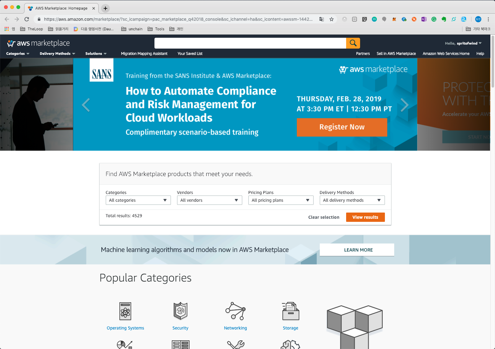
2. Search by keyword "ICON Development Network" or visit the URL below. Then, click **Continue to Subscribe**
https://aws.amazon.com/marketplace/pp/B07KBTZHZD?ref_=aws-mp-console-subscription-detail

3. Click **Continue to Configuration**
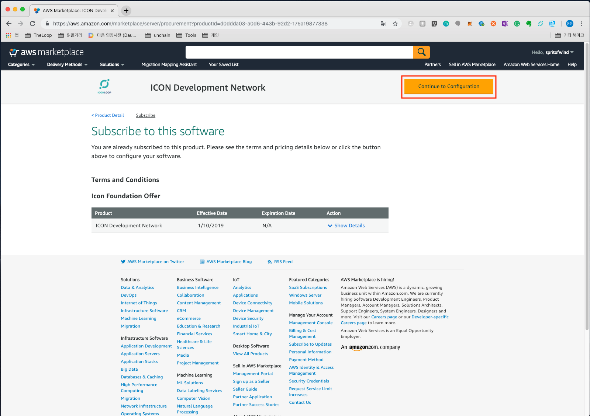
4. Select options (must select a specific region that you want to deploy). Then, click **Continue to Launch**
 - Fulfillment Option: Leave as default.
 - Software Version: Leave as default. It will provide the latest stable version. 
 - Region: **(Required)** Please select a region to setup.

5. From **Choose Action**'s drop downmenu, select **Launch CloudFormation** and click **Launch**
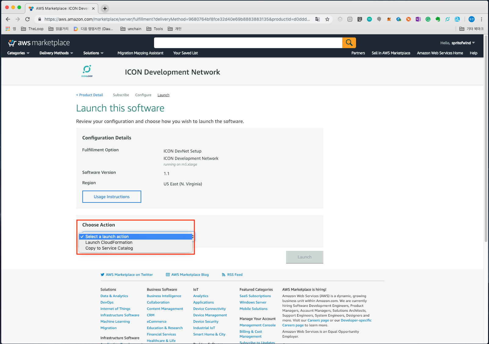
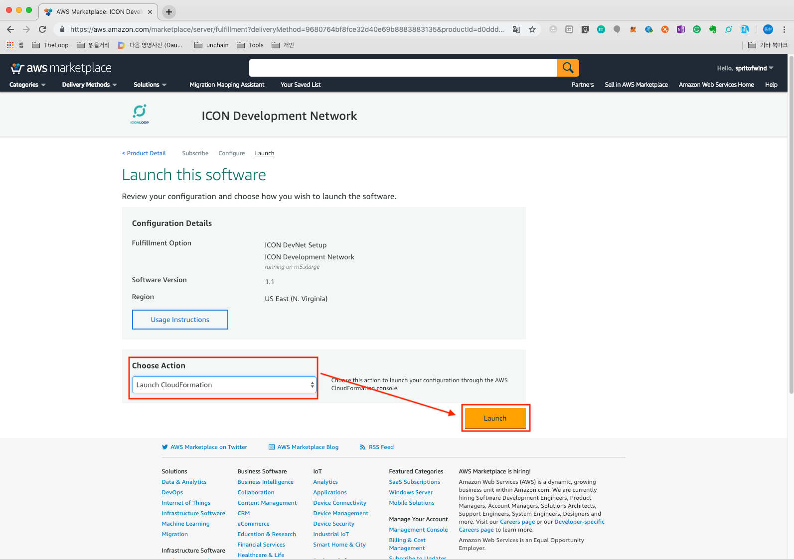
6. The "CloudFormation" screen appears. Select **Next**
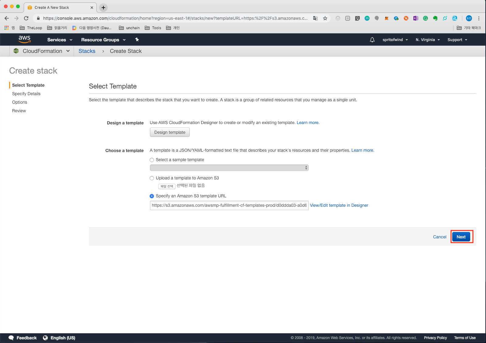
7. Step "Specify Details"
 - Stack Name: **(Required)** Any stack name (must contain only letters, numbers, dashes and start with an alpha character)
 - Instance Type: ICON EC2 instance type (t2.xlarge, m5.large, m5.xlarge, m5.2xlarge,c5.large, c5.xlarge). Default value is **m5.xlarge**
 - Node Count: ICON Node Cluster size; must be between 4 and 12. Default value is **4**.
 - InstanceName: EC2 Instance Name Prefix. Default value is **"ICON"**.
 - VpcId: **(Required)** VpcId of your existing Virtual Private Cloud (VPC). Select any drop-down menu item.
 - SubnetID: **(Required)** Subnet should be a public subnet. Select largest Subnet id (for example, \*.\*.0.0/32)
 - Fee: Pay commission to execute the transaction by ICX or not. Default value is **false**
 - Audit: Prevent to deploy SCORE by anybody or not. Default value is **false**
 - KeyName: **(Required)** Name of an existing EC2 KeyPair to enable SSH access to the instance. You must select EC2 Keypair. You must make sure to create a "Keypair" before this setup process.
 - SSHLocation: **(Required)** The IP address range that can be used to SSH to the EC2 instances. The setting with no limitation is "0.0.0.0/0".
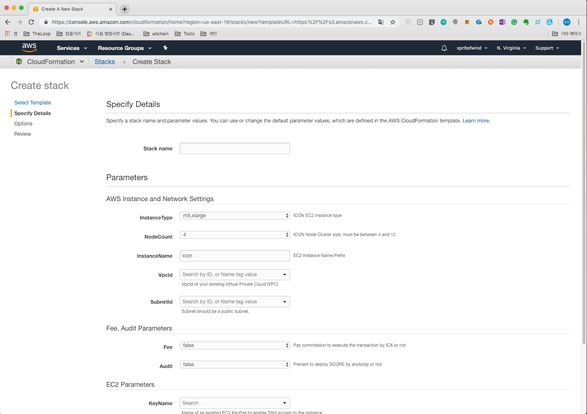
8. Step "Options". Leave as default. Select **Next**
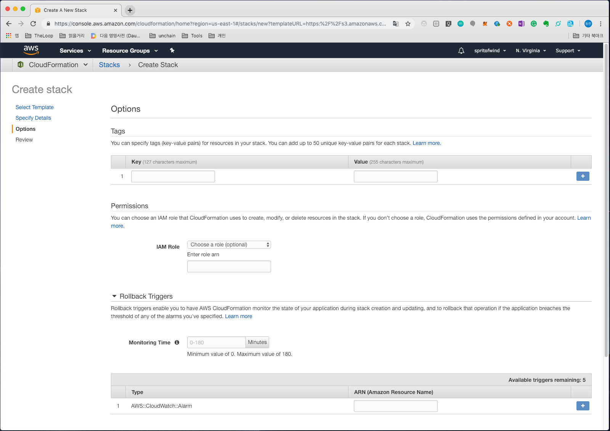
9. Step "Review". Select **Create**
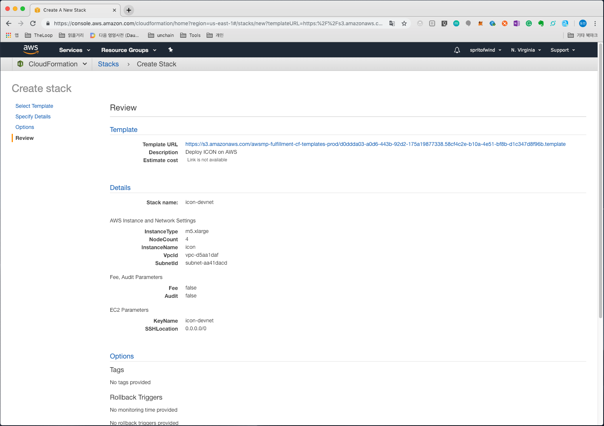
10. The setup process is over. Just need to check the **Events** tab below.
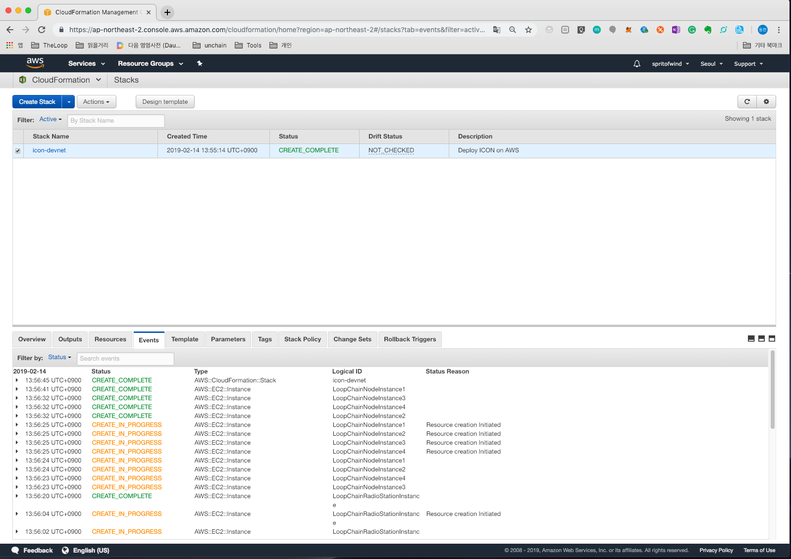
11. After the network has been deployed successfully using the CloudFormation, you can get information for **ICON Development Network**  from the **Outputs** tab. 

12. From **Outputs**, select "LoopChainRadioGroupCheckURL" for peers status.
 - "http://<YourRadiostationIP>:9002/api/v1/peer/list", you can check the information of connected nodes.


### EC2 instance connect & navigate
If you want to access each EC2 instance, you need public IP address of each EC2 Instance and private key selected during the CloudFormation process.
Get each EC2 instance Public IP address(**Peer\*PublicIP**. For Example, Peer1 PublicIP) information from Previous **Outputs**.

```
$ ssh -i yourkey.pem ec2-user@<Node Instance IP address>
```
You can see various configuration files and start.sh and stop.sh files in ec2-user's home directory.
```
$ ls -l
total 8
drwxrwxr-x 3 ec2-user ec2-user 194 Jan  3 01:54 conf
drwxrwxr-x 5 ec2-user ec2-user  43 Aug 10 01:18 elasticsearch
drwxrwxr-x 2 ec2-user ec2-user  25 Aug 10 01:33 fluentd_conf
drwxr-xr-x 3 root     root      56 Oct  4 03:40 iconscore
drwxr-xr-x 3 root     root      22 Oct  4 03:40 iconstate
drwxrwxr-x 3 ec2-user ec2-user  20 Aug  9 07:44 kibana
drwxrwxrwx 4 ec2-user ec2-user  55 Aug  9 08:06 log
drwxr-xr-x 2 root     root       6 Oct  4 03:40 score
drwxrwxr-x 6 ec2-user ec2-user  79 Aug 21 05:08 scripts
-rwxrwxrwx 1 ec2-user ec2-user 268 Jan  3 01:54 start.sh
-rwxrwxrwx 1 ec2-user ec2-user 267 Jan  3 01:54 stop.sh
drwxr-xr-x 6 root     root     124 Jan  3 01:55 storage
drwxr-xr-x 2 root     root       6 Oct  4 03:21 storageRS
```

ICON's services use [Docker Compose](https://docs.docker.com/compose/ "Docker Compose"). You can check the current containers as follows.
```
$ docker ps
CONTAINER ID        IMAGE                                                             COMMAND                  CREATED             STATUS              PORTS               NAMES
e144b9d76a6a        13.124.90.83:5000/loop-v1.2-rel/iconrpcserver:1810030300xbb2b02   "/bin/sh -c 'exec /e…"   22 minutes ago      Up 22 minutes                           peer_loop_rpc1_1
d2222b5f47ce        13.124.90.83:5000/loop-v1.2-rel/iconservice:1810030300xbb2b02     "/bin/sh -c 'exec /e…"   22 minutes ago      Up 22 minutes                           peer_loop_iconservice1_1
ec291c7b45c6        13.124.90.83:5000/loop-v1.2-rel/loop_queue:1810030300xbb2b02      "docker-entrypoint.s…"   22 minutes ago      Up 22 minutes                           peer_loop_queue_1
ab16726c94c6        13.124.90.83:5000/loop-v1.2-rel/loop_peer:1810030300xbb2b02       "/bin/sh -c 'exec /e…"   22 minutes ago      Up 22 minutes                           peer_loop_peer1_1

```
You can stop the services of the currently connected node and restart it by using stop.sh and start.sh.
```
$ ./stop.sh
Stopping peer_loop_rpc1_1         ... done
Stopping peer_loop_iconservice1_1 ... done
Stopping peer_loop_queue_1        ... done
Stopping peer_loop_peer1_1        ... done
```

```
$ ./start.sh
Starting peer_loop_iconservice1_1 ... done
Starting peer_loop_queue_1        ... done
Starting peer_loop_rpc1_1         ... done
Starting peer_loop_peer1_1        ... done

```

### Distributing Smart Contract on Reliable Environment (SCORE) using T-bears

T-bears is an ICON SCORE development suite.
The github address is:
https://github.com/icon-project/t-bears

#### Step 1: Installation
Install the T-bears by referring to the following link:
https://github.com/icon-project/t-bears#installation

#### Step 2: Block search & SCORE deploy

T-bears can build an environment that can be deployed in a local SCORE without using the AWS-generated Development Network. See Github for details.

We have already setup ICON Development Network with CloudFormation, we will deal with block search, Send Transaction & Get Transaction Result and SCORE distribution using this network.

##### Block search
Block lookup is possible without any other setting. Use the address of the LoopChainPeer.

###### lastblock
Retrieves the information of the last block in the current blockchain.
```
$ tbears lastblock -u http://<Node Instance IP address>:9000/api/v3
block info : {
    "jsonrpc": "2.0",
    "result": {
        "version": "0.1a",
        "prev_block_hash": "",
        "merkle_tree_root_hash": "72722dad5bdb0adff8f5fbb061de07a2404b522d463b708d1a62071262616fb3",
        "time_stamp": 0,
        "confirmed_transaction_list": [
            {
                "nid": "0x3",
                "accounts": [
                    {
                        "name": "god",
                        "address": "hx5a05b58a25a1e5ea0f1d5715e1f655dffc1fb30a",
                        "balance": "0x2961ffa20dd47f5c4700000"
                    },
                    {
                        "name": "treasury",
                        "address": "hxd5775948cb745525d28ec8c1f0c84d73b38c78d4",
                        "balance": "0x0"
                    },
                    {
                        "name": "test1",
                        "address": "hx670e692ffd3d5587c36c3a9d8442f6d2a8fcc795",
                        "balance": "0x2961ffa20dd47f5c4700000"
                    }
                ],
                "message": "ICONLOOP"
            }
        ],
        "block_hash": "b3c99e161f8013b7dabc2ff8be56bacb3209853d139bb54f0a37384388a36505",
        "height": 0,
        "peer_id": "",
        "signature": ""
    },
    "id": 1
}
```

###### blockbyheight
Set the height value of the block and get the information of the matching block.
```
$ tbears blockbyheight -u http://<Node Instance IP address>:9000/api/v3 0
block info : {
    "jsonrpc": "2.0",
    "result": {
        "version": "0.1a",
        "prev_block_hash": "",
        "merkle_tree_root_hash": "72722dad5bdb0adff8f5fbb061de07a2404b522d463b708d1a62071262616fb3",
        "time_stamp": 0,
        "confirmed_transaction_list": [
            {
                "nid": "0x3",
                "accounts": [
                    {
                        "name": "god",
                        "address": "hx5a05b58a25a1e5ea0f1d5715e1f655dffc1fb30a",
                        "balance": "0x2961ffa20dd47f5c4700000"
                    },
                    {
                        "name": "treasury",
                        "address": "hxd5775948cb745525d28ec8c1f0c84d73b38c78d4",
                        "balance": "0x0"
                    },
                    {
                        "name": "test1",
                        "address": "hx670e692ffd3d5587c36c3a9d8442f6d2a8fcc795",
                        "balance": "0x2961ffa20dd47f5c4700000"
                    }
                ],
                "message": "ICONLOOP"
            }
        ],
        "block_hash": "b3c99e161f8013b7dabc2ff8be56bacb3209853d139bb54f0a37384388a36505",
        "height": 0,
        "peer_id": "",
        "signature": ""
    },
    "id": 1
}
```

###### Send Transaction & Get Transaction Result
Keystore is needed when sending a transaction or when deploying a SCORE onto the network. You can generate a keystore file using T-Bears CLI.
First, create a keystore.
```
$ tbears keystore <keystorepath>
Input your keystore password:
Retype your keystore password:
Made keystore file successfully
```

When you open the keystore that you just created, you can see that the first keystore address is created in the address field.
```
$ cat <keystorepath>
{"address": "hx4d1042e98770dcbab06ae4b55d09b1215e6d3af8", "crypto": {"cipher": "aes-128-ctr", "cipherparams": {"iv": "2621384865fceeb2988767c64dfe274e"}, "ciphertext": "5505c45ff3dce6742aa4f1630ffbc154b090176716e06942ec67f9bd1549e48b", "kdf": "scrypt", "kdfparams": {"dklen": 32, "n": 16384, "r": 1, "p": 8, "salt": "716a3d1ea83d6e540caeba473bea155d"}, "mac": "a88bc55b881f8b6c74b18b2d73d153bea8d5e178b3d54ae0f500be5e627c0cf1"}, "id": "e1939d52-617e-4a18-96c0-aec1b1cdfbc1", "version": 3, "coinType": "icx"}
```

Before sending the transaction. You need to create a send.json file that file contains "from" and "to" information. "from" is the send address and "to" is the receive address (you can also use the address of the genesis block that you viewed with the lastblock or blockbyheight, since it is not a commission function because it is a development network).
```
$ vi send.json
{
  "jsonrpc": "2.0",
  "method": "icx_sendTransaction",
  "params": {
    "version": "0x3",
    "from": "hx670e692ffd3d5587c36c3a9d8442f6d2a8fcc795",
    "value": "0x0",
    "stepLimit": "0x3000000",
    "nid": "0x3",
    "nonce": "0x1",
    "to": "hx4d1042e98770dcbab06ae4b55d09b1215e6d3af8",
    "dataType": "call",
    "data": {
      "method": "setValue",
      "params": {
        "value": "0x123"
      }
    }
  },
  "id": 1
}
```
Now, let's send a Transaction.
```
$ tbears sendtx -k <your keystore path> -u http://<Node Instance IP address>:9000/api/v3 send.json
Input your keystore password:
Send transaction request successfully.
transaction hash: 0x2797cd29bd4f56ac82a732cd88d5269ed16739526dd37ccbdd23159c3610a464
```

The confirmation of the sent transaction can be done as follows.
```
$ tbears txresult -u http://<Node Instance IP address>:9000/api/v3 0x2797cd29bd4f56ac82a732cd88d5269ed16739526dd37ccbdd23159c3610a464
Transaction result: {
    "jsonrpc": "2.0",
    "result": {
        "txHash": "0x2797cd29bd4f56ac82a732cd88d5269ed16739526dd37ccbdd23159c3610a464",
        "blockHeight": "0x3",
        "blockHash": "0x9317c73b58a1d2d7838b4b7a40d164bc138c51eacbdaf3198d856b830a8a721f",
        "txIndex": "0x0",
        "to": "hx4d1042e98770dcbab06ae4b55d09b1215e6d3af8",
        "stepUsed": "0xf4a10",
        "stepPrice": "0x0",
        "cumulativeStepUsed": "0xf4a10",
        "eventLogs": [],
        "logsBloom": "0x0000000000........0000000000",
        "status": "0x1"
    },
    "id": 1
}
```

###### SCORE (Smart Contract on Reliable Environment) Deploy

Now that you have a transaction send, let's deploy SCORE.
In T-bears, you can create a basic SCORE. Let's create a SCORE named ABCToken.
```
(work) $ tbears init abc ABCToken
(work) $ ls abc
__init__.py  abc.py  package.json  tests
```
SCORE called ABCToken was created in the abc folder. Now distribute SCORE to the generated Develop Network.
```
$ tbears deploy -u http://<Node Instance IP address>:9000/api/v3 -k <your keystore path> abc
Input your keystore password:
Send deploy request successfully.
If you want to check SCORE deployed successfully, execute txresult command
transaction hash: 0x247ae6cfd8d321420dc93e94d56bdb9e30d8a4c194141f7876ae63f7f995a4db
```
If "Send deploy request successfully" message appears, the distribution was successful. Now, let's check the SCORE address using txresult again with the resulting transaction hash value.

```
$ tbears txresult -u http://<Node Instance IP address>:9000/api/v3 0x247ae6cfd8d321420dc93e94d56bdb9e30d8a4c194141f7876ae63f7f995a4db
Transaction result: {
    "jsonrpc": "2.0",
    "result": {
        "txHash": "0x247ae6cfd8d321420dc93e94d56bdb9e30d8a4c194141f7876ae63f7f995a4db",
        "blockHeight": "0x4",
        "blockHash": "0x6909b8bf9e280ef6f0b059850cd8c42078eeda96825ed38557e9ce74712c2cd4",
        "txIndex": "0x0",
        "to": "cx0000000000000000000000000000000000000000",
        "scoreAddress": "cxe0b089a8b718037c537f877aff52ddb55724df21",
        "stepUsed": "0x12eadf0",
        "stepPrice": "0x0",
        "cumulativeStepUsed": "0x12eadf0",
        "eventLogs": [],
        "logsBloom": "0x0000000000........0000000000",
        "status": "0x1"
    },
    "id": 1
}
```
The scoreAddress value from txresult is the address of the ABCToken that was released earlier. In this example, we can see that it is cxe0b089a8b718037c537f877aff52ddb55724df21.
Now, to check this SCORE API, we check the API of SCORE deployed using scoreapi.
```
$ tbears scoreapi -u http://<Node Instance IP address>:9000/api/v3 cxe0b089a8b718037c537f877aff52ddb55724df21
SCORE API: [
    {
        "type": "fallback",
        "name": "fallback",
        "inputs": []
    },
    {
        "type": "function",
        "name": "hello",
        "inputs": [],
        "outputs": [
            {
                "type": "str"
            }
        ],
        "readonly": "0x1"
    }
]
```

You can check the **hello** method of SCORE's API and call it.
First, create a config file called **call.json** and write it like this:

```
$ vi call.json
{
  "jsonrpc": "2.0",
  "method": "icx_call",
  "params": {
    "from": "hx4d1042e98770dcbab06ae4b55d09b1215e6d3af8",
    "to": "cxe0b089a8b718037c537f877aff52ddb55724df21",
    "dataType": "call",
    "data": {
      "method": "hello"
    }
  },
  "id": 1
}
```

"from" is the address of the previously created key, and "to" is the address of the previously SCORE deployed.
The method in the data section means that we will look up the hello method that we just looked up.
Let's call it using this file.
```
$ tbears call -u http://<Node Instance IP address>:9000/api/v3 call.json
response : {
    "jsonrpc": "2.0",
    "result": "Hello",
    "id": 1
}
```
If you get the above results, It is a success.

## Extend the learning
Easy way to check **ICON Development Network** status. - Use Chrome extenstion program ([**POSTMAN**](https://chrome.google.com/webstore/detail/postman/fhbjgbiflinjbdggehcddcbncdddomop?hl=en))

From outputs. Get "LoopChainPeer\*CheckURL"(ex. LoopChainPeer1CheckURL. any LoopChainPeer\*CheckURL) information.
ex) http://ec2-54-180-148-115.ap-northeast-2.compute.amazonaws.com:9000/api/v3
Send below JSON message to LoopchainPeer1CheckURL(POST method)

```
{
      "jsonrpc": "2.0",
      "method": "icx_getLastBlock",
      "id": 1234
}
```

If you receive the following response, "ICON Development Network" status is normal.
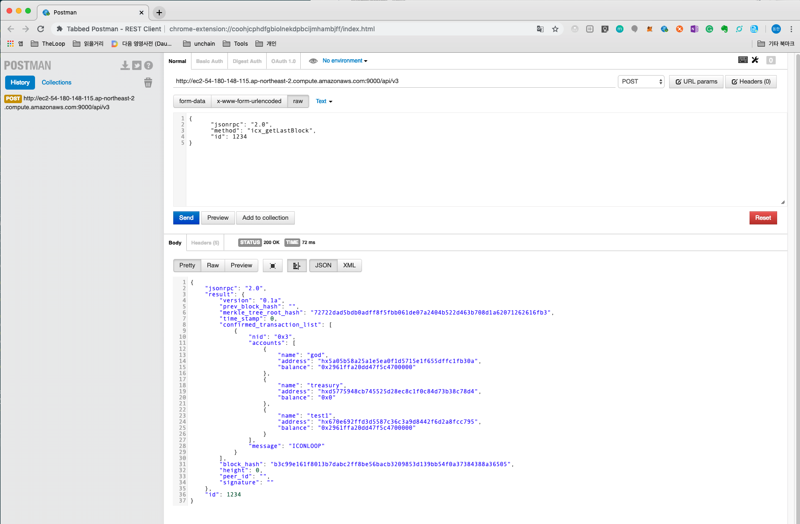

## Summarize the learning
Congratulations on setting up your ICON Development Network on AWS!

## Tips or FAQs


## References

**ICON JSON-RPC API v3**
https://github.com/icon-project/icon-rpc-server/blob/master/docs/icon-json-rpc-v3.md

**Amazon EC2 Key Pairs**
https://docs.aws.amazon.com/AWSEC2/latest/UserGuide/ec2-key-pairs.html

**Amazon EC2 Service Limits**
https://docs.aws.amazon.com/AWSEC2/latest/UserGuide/ec2-resource-limits.html


