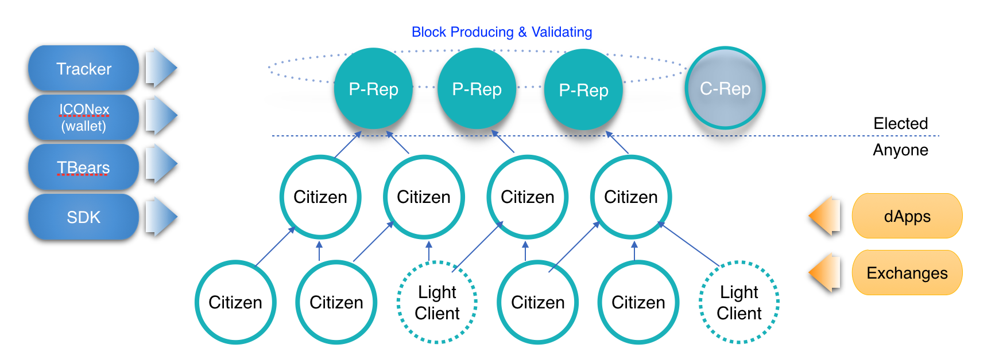

ICON Network
==============

This document presents what kinds of nodes are in the ICON network. 
Node means the computer server which participates in the blockchain protocol.
All nodes keep the full or partial copy of blockchain data, and excute transactions in the blocks for validation.
So all nodes should be connected to internet, and have their own address to identify themselves.

## Types of Nodes

There are three types of nodes in ICON netwrok.
Peer nodes can participate in the consensus protocl, so they can produce and propose block.
Citizen nodes just sychronize the blockchain data, and relay the transaction to Peer node.
**Light clients** just synchronize the header of blocks for simple verification of transactions.

The user and smart contract can access (query or send trasactoins) these nodes through ICONex wallet or ICON SDK. 
Of course, they can also access the nodes using JSON RPC directly.

## Peer

There are two type of Peer nodes, Public and Commuinity Representitive. 
As you see in the word "Representitive", these nodes are supposed to be elected by ICONist or Community members.
Details of election are presented in [ICONSENSUS](https://icon.community/iconsensus/).

Peer nodes are the essential entities of ICON network. 
They have roles to produce and validate the blocks, which contains transactions transmitted into ICON network.
All transactions sent to ICON network are relayed or directed to Peer nodes.
One of Peer nodes becomes the leader node, who have right to produce the block for his turn. 
And the other Peer nodes validate that block. The block is confirmed when 2/3 of Peer nodes agree on that block.
Peer nodes will become a leader node in a pre-defined order, and produce one block for their turn.

### Public Representative (P-Rep)

### Community Representative (C-Rep)

## Citizen

Citizen nodes synchronize the blockchain data from Peer nodes. 
Of course, Citizen also executes the trasactions in the block for verifying them.
So we can provide the confidence of block data downloaded from Peer nodes.
In addition, Citizen relays the trasactions to the Peer nodes.

In general, Citizen is used for service end-point of ICON Network. 
It gives queries to the users, and relays transactions to the Peer nodes.
It is designed that no trasanctions and queries are supposed to access the Peer nodes directly.
This architecture keeps the Peer nodes focusing on consensus, that is, producing and validating blocks. 
Limited access to Peer nodes makes the ICON network more safe.

Since Citizen verify the blocks and transactions, Exchanges or DApp operator had better running Citizen inside their network, rather than using publicly opened Citizen outside the network.

## Light Client

To be continued.

