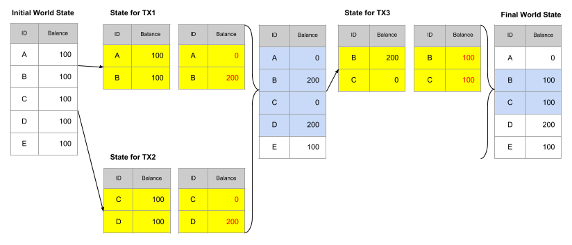
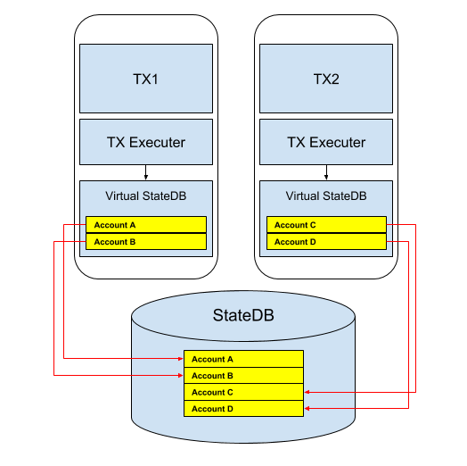

Performance of blockchain can be influenced by various factors.
One of the major factors is the execution time of transactions.
To reduce this, we may apply the parallel processing on it.

## Problem definition

Performance of blockchain is influenced by following major factors.
* Execution time of transactions
* Transfer time of transactions
* Communication time for consensus

Various blockchains have already improved their protocols to reduce network
traffics. Considering liveness and safety of blockchain, it's hard to reduce
network traffics more without risk.

If we can reduce execution time, we may improve the performance of blockchain
without risk.

## Our solutions

Basically, we may reduce execution time with stronger computing power.
There is a limit in increasing power of a core, so many of platforms increases
its computing power executing tasks in parallel with multiple cores.

But normally, transactions are executed sequentially because previous
transactions may influence the execution of the current transaction.
If previous transactions don't influence the execution, then we can
execute it in parallel with previous ones.

If we know relevant accounts of transactions, we may execute independently
transactions in parallel.

### Simple transfer

A simple transfer may change balances of 3 accounts (sender, receiver, and treasury).
We may handle treasury deposit after executing whole transactions based on the
results of the transactions. So, only 2 accounts are relevant accounts.

So, we may apply parallel processing to the following transactions.

1) Transfer A to B: 100
2) Transfer C to D: 100
3) Transfer B to C: 100

In sequential processing, it takes T (time for simple transfer) x 3.
But, if we execute (1) and (2) in parallel, it takes T x 2.

So, we may execute some of the transactions in parallel, and it reduces
time to get the final state of the transactions in the block.

The same strategy can also be applied to the smart contract.

### Application on a smart contract

A transaction to the smart contract is mapped to a method call of the SCORE.
A normal method of SCORE may change the state of any accounts, because
it may call methods of other SCORE. So, basically, a method of SCORE
needs write-permission to all accounts.

But, some methods may require limited permission to accounts.
In that case, we may call independent methods in parallel.
To do this, we need extra information about the method.

With this information, we may make virtual world state for each transaction.
So, when it changes the world, it does affect world state if it's allowed.
Otherwise, it results in transaction failure.

With this scheme, we can execute two transactions in parallel on following
configuration.

After executing them, they release locked accounts to let other transactions
can compose own environments locking required accounts.

For this, the smart contract provides information about relevant accounts for
each method. And also it may split its database and codes into several parts
to enhance parallelism.