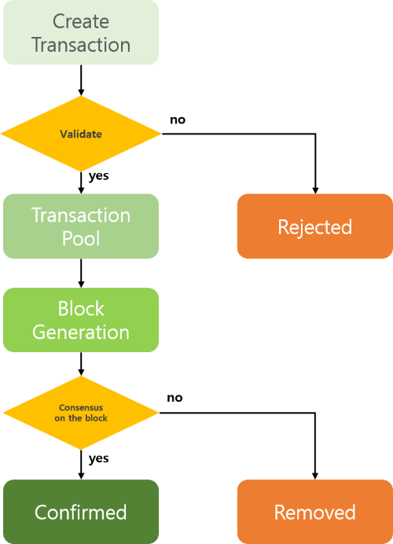

This describes the definition of a transaction in ICON, functionalities, and specification. You can get a basic understanding of transaction in ICON from this page.

## Transaction

### Definition

The term “transaction” in ICON refer to the "signed" data package which is used for changing the states of a blockchain (e.g. deploying a SCORE, ICX coin transfer, etc) . A transaction always has to involve signature data.

### Purpose of Signature

- The signature prevents transaction data from forge or falsification. for example, If the transaction data is falsified while propagation, valid signature (i.e. expected valid signature data) data also change. As no one can generate the valid signature except the owner of an account who generates a transaction, this transaction will be failed while verifying a transaction. 
- Signature guarantee that a transaction data has been generated by the owner of an account.

The detail of generating transaction signature is defined in [How to Generate Transaction Signature](https://github.com/icon-project/documentation/blob/develop/howto/how-to-generate-a-transaction-signature.md).

### Function of Transaction

- ICX Coin transfer
- Record message on the blockchain
- Deploy or update SCOREs
- Change SCORE's states

### Life Cycle of Transaction

#### Create Transaction

Create and propagate a transaction to ICON network. Propagated transaction proceed with basic syntax and signature validation, and is put into the transaction pool for being recorded to a block if they are valid. If a transaction is invalid, that transaction is immediately rejected. A word "rejected" refers to being removed because it can not be propagated on the ICON network.

#### Transaction Pool

In this stage, a transaction is waiting in the transaction pool before being put into the block

#### Block Generation

In this stage, a transaction is put into a generated block. If the consensus is finally reached about the generated block (after consensus process), that block is connected to the blockchain, and  transactions in the block are recorded permanently.

#### Confirmed

The block which contains a transaction is connected to the blockchain after consensus process. This state of a transaction is called "confirmed". A transaction in the block is recorded permanently regardless of a transaction processing result (whether success or failure).

### How to Check Transaction State

#### Check the Transaction Validation

If you get the transaction hash as a response of sending transaction to the ICON network, this means that your transaction has passed the validation. ICON network returns the transaction hash only when a transaction is valid. The specific information about this, see the JSON-RPC APIs "icx_sendTransaction" section of the [ICON JSON-RPC API v3 Specification](https://github.com/icon-project/documentation/blob/develop/references/json-rpc/icon-json-rpc-v3.md) documentation.

#### Check the Transaction Confirmation

You can check if the transaction is confirmed or pending using "icx_getTransactionResult" JSON-RPC API. "pending" means that a transaction is on the transaction pool or block generation stage. The specific information about this, see the JSON-RPC APIs "icx_getTransactionResult" section of the [ICON JSON-RPC API v3 Specification](https://github.com/icon-project/documentation/blob/develop/references/json-rpc/icon-json-rpc-v3.md) documentation.

### Specification
The specific information on transaction data, see the JSON-RPC APIs "icx_sendTransaction" section of the [ICON JSON-RPC API v3 Specification](https://github.com/icon-project/documentation/blob/develop/references/json-rpc/icon-json-rpc-v3.md) documentation.
