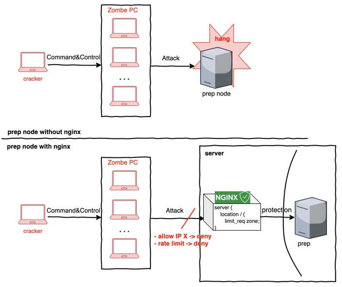
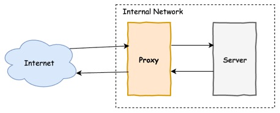
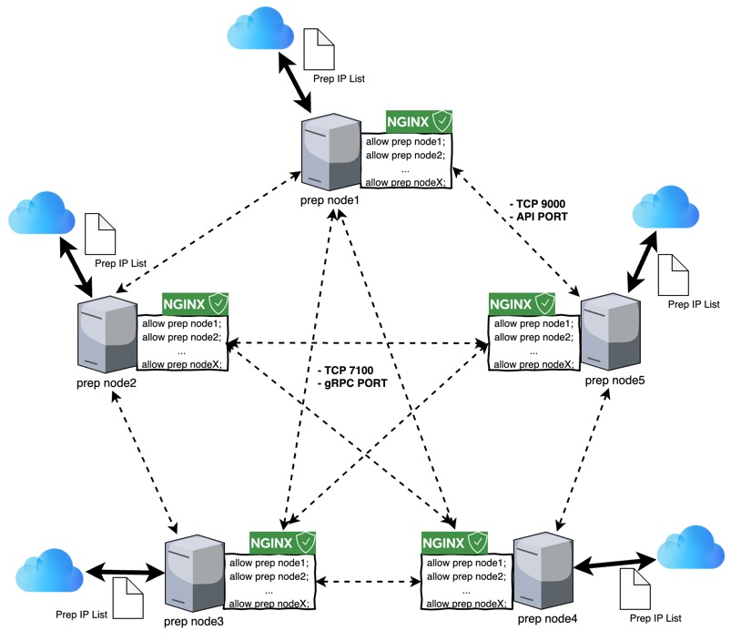
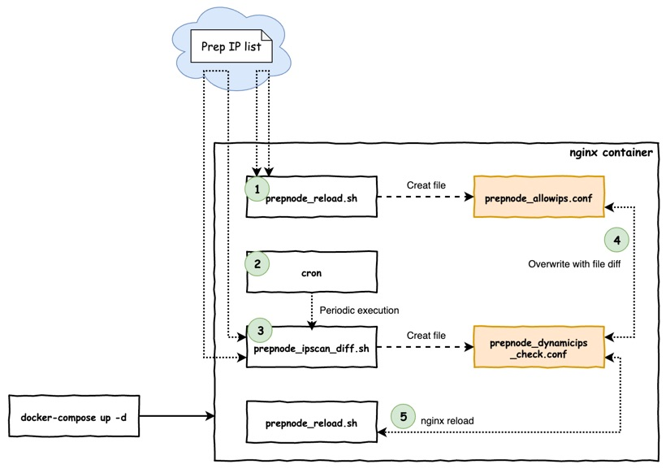

This document is a guideline about how to prevent DDoS attacks using nginx.

## Intended Audience
We recommend all P-Rep candidates to go through this guideline.

## Pre-requisites
We assume that you have previous knowledge and experience in:
- IT infrastructure management
- Linux or UNIX system administration
- Network administration
- Linux server and docker service troubleshooting
- Docker container

### Introduction to Nginx
Nginx is a web server that optimizes security and speed that consists of one master process and several worker processes.
Nginx functions in an event-driven way and processes events when a new event occurs asynchronously.
It functions efficiently with a small number of threads, thus uses less CPU and requires less memory.
Using nginx in reverse proxy mode prevents DDoS attacks by throttle setting and enables whitelist based networks.




### Reverse proxy advantage
The reverse proxy receives data from the internal server and sends it to the client. This prevents direct access to the internal server and acts as a relay for indirect access. The reverse proxy has many security advantages.


1. Security: External users cannot recognize the existence of servers on the actual internal network. All transmissions happen through the reverse proxy server which maps the request to the internal server information and processes accordingly. This helps to protect internal server information from the external environment.
2. ACL: Defines whether to allow or deny access from external users.
3. Log/Audit: Check the information of external users who try to access the network.

## How to use 
### Prep + Nginx composition
##### Nginx reverse package for prep node
- dockerized nginx will be provided - please refer to the link below.
- < github url > 
* Configure P-Rep node software based on nginx so that each node can communicate through nginx.
* Set nginx allow ip to whitelist accessible IPs from P-Rep nodes.* Monitor the P-Rep node IP on a regular basis and renew the IP list if there is a change in allow ip. 
* Install docker in bridge mode.




##### IP whitelist renewal
* One can either block all IPs or allow only specific IPs (or bands)
* Granting access to whitelisted P-Rep nodes, external attacks can be prevented.



- Add Prep IP List to the whitelist
	- An iInternal script calls the Prep IP List(Call API) on a regular basis, creates the whitelist, and reloads nginx.
- How to add to the whitelist
	- Create `allow_ip.conf` that includes the whitelist
```nginx
#./user_conf/allow_ip.conf
    allow 10.10.10.10;
    allow 20.20.20.20;
    allow 30.30.30.30;
```
  - Add environment variable to `docker-compose.yml` environment variable
```yaml
version: '3'
services:
   nginx:
     images:
     ...
     vloumes:
        - ./user_conf/allow_ip.conf:/etc/nginx/user_conf
##################################################################
## Mount allow_ip.conf to docker volume
## File name can be random since all files in /etc/nginx/user_conf areis accessible within nginx docker
```
  - There is no service suspension in case of nginx reload. 

##### Nginx Throttle
* Throttle setting
	* Use the ‘limit_req’ module to limit excessive requests from an IP or a specific URI
	* e.g. Process 100 requests per second of an IP
	* e.g. Process exactly 100 requests per second of an IP

```nginx
# throttle setting example
limit_req_zone $binary_remote_addr zone=by_ip:10m rate=200r/s;
limit_req_zone $request_uri zone=by_uri:10m rate=200r/s;

# limit_req_zone : Declare a zone to limit the request
# binary_remote_addr : Client IP based limit
# request_uri : URI based limit
# share memory assign : 10M
# rate : If there are more than 200 requests per second, further requests will be limited
```
##### Dockerizing
```nginx
#nginx docker-compose.yml
version: '3'
services:
   nginx:
     images:
     environment:
         NGINX_LOG_OUTPUT: 'file'
         NGINX_LOG_TYPE: 'main'
         NGINX_USER: 'root'
         VIEW_CONFIG: "yes"
         USE_NGINX_THROTTLE: "yes"
         NGINX_THROTTLE_BY_IP: "yes"
         NGINX_RATE_LIMIT: "200r/s"
         NGINX_BURST: "5"
         NGINX_SET_NODELAY: "no"
         LISTEN_PORT: 7100
         GRPC_PROXY_MODE: "yes"
         PROXY_PASS_ENDPOINT: "grpc://prep:7100"
         USE_VTS_STATUS: "yes"
         TZ: "GMT-9"
         SET_REAL_IP_FROM: "0.0.0.0/0"
         PREP_MODE: "yes"
         PREP_LISTEN_PORT: 9000
         PREP_PROXY_PASS_ENDPOINT: "http://prep:9000"
         PREP_NODE_LIST_API: "preptest01:9000/api/v3"
         USER_NGINX_ALLOWIP: "yes"
         LOCATION: "location ~ /api/ws/* {proxy_pass http://_upstreamer;proxy_http_version 1.1;proxy_set_header Upgrade $$http_upgrade;proxy_set_header Connection 'Upgrade'; proxy_read_timeout 1800s;} location ~ /api/node/* {proxy_pass http://_upstreamer;proxy_http_version 1.1;proxy_set_header Upgrade $$http_upgrade;proxy_set_header Connection 'Upgrade'; proxy_read_timeout 1800s;} "
         NGINX_LOG_FORMAT: '$$realip_remote_addr $$remote_addr  $$remote_user [$$time_local] $$request $$status $$body_bytes_sent $$http_referer "$$http_user_agent" $$http_x_forwarded_for $$request_body'
     volumes:
         - ./data/loopchain/nginx:/var/log/nginx
         - ./user_conf:/etc/nginx/user_conf
     ports:
         - '7100:7100'
         - '9000:9000'
```
##### environment variable


|environment variable|	default	|Description|
|----|-----|-----|
|USER_NGINX_ALLOWIP |	no|	allow ip other than prepo node IP (yes/no) if yes, /etc/nginx/user_conf mount path is needed|
|PREP_MODE|	no	|if prep node, yes|
|PREP_NODE_LIST_API|	http://domain.com/api/v3|	API URL to check prep node ip|
|PREP_LISTEN_PORT	|9000| JSON-RPC port, Since a docker runs in a bridge mode, a port is essential. All prep transmission happens through nginx.|
|LISTEN_PORT|	7100| gRPC port|
|PREP_PROXY_PASS_ENDPOINT|	Endpoint of http://prep:9000|JSON-RPC(API)|
|PROXY_PASS_ENDPOINT|	grpc://prep:7100	|Endpoint of gRPC|
|GRPC_PROXY_MODE|	yes	|gRPC proxy mode usage (yes/no)|
|USE_NGINX_THROTTLE | |rate limit usage (yes/no)|
|NGINX_THROTTLE_BY_IP	| |URI based rate limit usage (yes/no)|
|NGINX_THROTTLE_BY_URI	| |IP based rate limit usage (yes/no)|
|NGINX_RATE_LIMIT|	200r/s	|rate limit threshold|
|NGINX_BURST|	5	|Maximum queue in case the rate limit exceeds (If the limit is the 5th, applicable from the 6th)|
|USE_DOCKERIZE	|yes	|go template usage ( yes/no )|
|VIEW_CONFIG|	no|	config print at launch ( yes/no )|
|DOMAIN|	localhost|	domain setting|
|LOCATION	||ADD_LOCATION|
|WEBROOT|	/var/www/public|	webroot setting|
|NGINX_EXTRACONF	||additonal conf setting|
|USE_DEFAULT_SERVER	||default setting|
|NGINX_USER|	wwwdata|	nginx daemon user|
|NUMBER_PROC|	$(nproc)	|number of worker_processes (cpu core by default)|
|WORKER_CONNECTIONS|	4096|	WORKER_CONNECTIONS|
|SENDFILE|	on|	on|
|SERVER_TOKENS|	off|	off|
|KEEPALIVE_TIMEOUT|	65|	65|
|KEEPALIVE_REQUESTS|	15|	15|
|TCP_NODELAY|	on|	on|
|TCP_NOPUSH|	on|	on|
|CLIENT_BODY_BUFFER_SIZE	|3m	|3m|
|CLIENT_HEADER_BUFFER_SIZE|	16k|	16k|
|CLIENT_MAX_BODY_SIZE|	100m	|100m|
|FASTCGI_BUFFER_SIZE	|256K|	256K|
|FASTCGI_BUFFERS|	8192 4k	|8192 4k|
|FASTCGI_READ_TIMEOUT|	60|	60|
|FASTCGI_SEND_TIMEOUT|	60|	60|
|TYPES_HASH_MAX_SIZE|	2048|	2048|
|NGINX_LOG_TYPE|	default|	LOGTYPE (json/default)|
|NGINX_LOG_OUTPUT|	file|	stdout or file or off|
|SET_REAL_IP_FROM|	0.0.0.0/0	|make client IP accessible|
|NGINX_PROXY_TIMEOUT|	90|	90|

